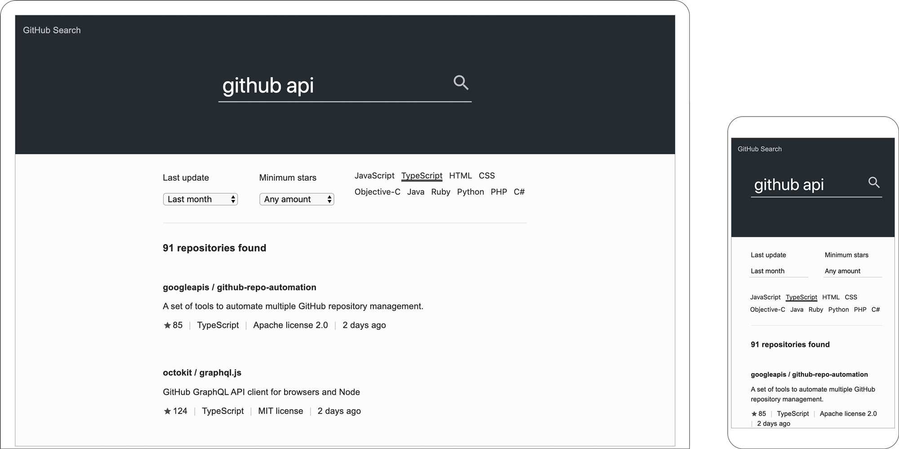

# GitHub Search (React)

This project is a simple app that provides a UI to search GitHub repositories using the [GitHub Search API](https://developer.github.com/v3/search/).

It is a reimplementation of [GitHub Search](https://github.com/garciaalvaro/github-search), built in TypeScript using React and Redux.

- Built in **TypeScript** using **React** and **Redux**
- It provides a server using **Node.js** and **Express** on port 4000
- The CSS is built using **Stylus**
- The **Webpack** bundler transforms the files and transpiles them using Babel, and other loaders and plugins
- It provides configuration files for **eslint** linter
- Tests are included using **Jest** and **Enzyme**

---

## Getting Started

### Prerequisites

To run this project make sure you have installed Node.js and npm in your machine.

### Installing and running

Install the project dependencies and start the server. From the root directory inside your terminal follow this steps:

- Install the dependencies: `$ npm install`
- Once finished, bundle the files and start the server: `$ npm start`
- Visit http://localhost:4000 in your browser

### Notes

- To stop the server run: `$ npm stop`
- You may also run the server and Webpack in development mode: `$ npm run dev`

### Testing

- To run the provided tests, simply run: `$ npm test`

## Screenshots

---

## Changelog

#### 1.1.0

- Added tests using Jest and Enzyme
- Added util functions for unit testing
- Minor bug fixes

#### 1.0.0

- Initial release of functioning app
